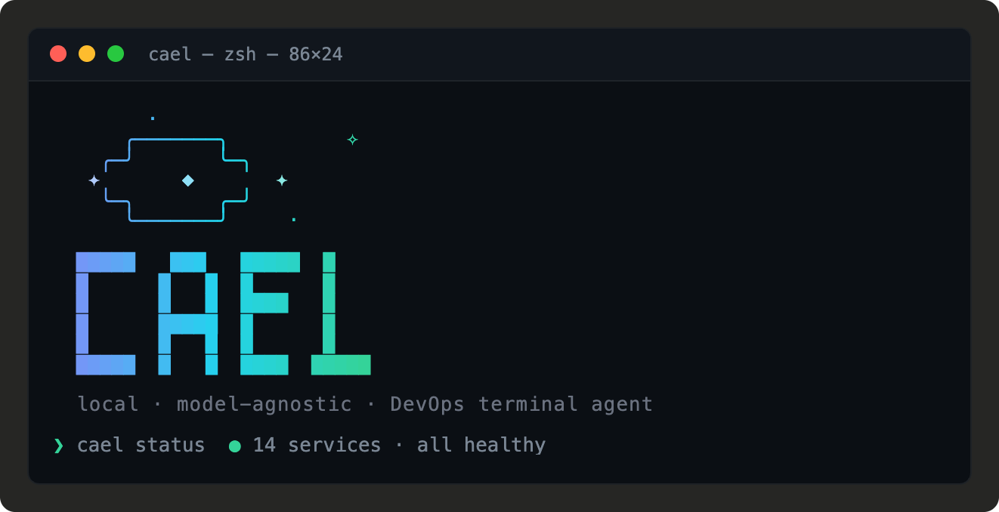

**A live AI brain for your terminal.** Cael watches your system, reasons about it, and answers questions in plain English — grounded in real data, not guesses.

> Built with [Bun](https://bun.sh). Runs anywhere. Talks to any LLM.

---

## What does it actually do?

Most AI tools are chat interfaces bolted onto an editor. Cael is different: it's a **live DevOps dashboard with an agent loop running inside it**.

```
╔══════════════════════════════════════════════════════════════╗
║  cael watch   11:28 PM         [/] ask          [q] quit    ║
╠══════════════════╦═══════════════════╦═══════════════════════╣
║  SYSTEM          ║  DOCKER           ║  GIT                 ║
║    CPU   4%      ║    daemon running ║    feat/agentic-mode  ║
║    MEM   15.3GB  ║    api       ● UP ║    1 untracked file  ║
║    DISK  44%     ║    worker    ✕ -- ║    0 unpushed        ║
║    LOAD  1.65    ║    db        ● UP ║                      ║
╠══════════════════╩═══════════════════╩═══════════════════════╣
║  ⚠ Memory 97% used                                          ║
╠══════════════════════════════════════════════════════════════╣
║                                                              ║
║  > what's eating all my memory?                             ║
║                                                              ║
║  ⟳ calling get_process_list...                              ║
║                                                              ║
║  The top consumers are Bun (1.8 GB), VS Code (1.2 GB),      ║
║  and Chrome (4.1 GB across 12 tabs). Your system is at      ║
║  97% — consider closing browser tabs or restarting VS Code  ║
║  extensions to reclaim ~2 GB quickly.                       ║
║                                                              ║
║  [↑↓] scroll · [any other key] dismiss                      ║
╚══════════════════════════════════════════════════════════════╝
```

Press `/`, ask a question. Cael **actually runs tools** — checks your process list, reads Docker logs, inspects git state — then gives you an answer grounded in the real current state of your machine. Not vibes. Facts.

---

## The agent loop, visualised

```
  You press /                    
      │                          
      ▼                          
  ┌─────────────────────────────┐
  │  "what's eating my memory?" │
  └────────────┬────────────────┘
               │
               ▼
      ┌─────────────────┐
      │  Cael thinks... │  ← LLM sees live snapshot
      └────────┬────────┘
               │ calls tool
               ▼
      ┌─────────────────┐
      │ get_process_list│  ← real data, not fabricated
      └────────┬────────┘
               │ result
               ▼
      ┌─────────────────┐
      │  Cael thinks... │  ← reasons over actual output
      └────────┬────────┘
               │ end_turn
               ▼
      ┌──────────────────────────────────────────────┐
      │  "Chrome is using 4.1 GB across 12 tabs..."  │
      └──────────────────────────────────────────────┘
```

Every answer is backed by a real tool call. Conversation history persists across queries in a session, so follow-up questions just work.

---

## Commands

### `cael watch` — live dashboard + AI agent

```bash
bun run index.ts --provider anthropic:claude-opus-4-8 watch
```

The crown jewel. A full-screen TUI that refreshes every 5 seconds and lets you interrogate your system in plain English. The agent can:

- Run `get_process_list` → find what's burning CPU or RAM
- Call `get_docker_logs` → diagnose container crashes
- Use `run_shell` → dig deeper with real commands  
- Check `get_git_status` → tell you if it's safe to deploy
- Read files → inspect config, logs, whatever

Multi-turn conversation. Streaming responses. Tool activity shown live. Scroll long answers with `↑↓`.

---

### `cael ask` — one-shot question

```bash
bun run index.ts --provider anthropic:claude-opus-4-8 ask "why is disk usage so high?"
```

Same agent loop, no dashboard. Ask and get out.

---

### `cael deploy-check` — go / no-go before pushing

```bash
bun run index.ts --provider anthropic:claude-opus-4-8 deploy-check
```

```
╔══════════════════════════════════════╗
║  DEPLOY CHECK          score: 82/100 ║
╠══════════════════════════════════════╣
║  ✓  CPU nominal          (4%)        ║
║  ✓  Memory OK            (61%)       ║
║  ✓  Disk healthy         (44%)       ║
║  ⚠  2 dirty files in git            ║
║  ✓  All containers UP               ║
╠══════════════════════════════════════╣
║  Verdict: CAUTION — commit or stash  ║
║  your changes before deploying.      ║
╚══════════════════════════════════════╝
```

Scores your system 0–100. Plain-English verdict. No surprises in prod.

---

### `cael postmortem` — incident report, auto-drafted

```bash
bun run index.ts --provider anthropic:claude-opus-4-8 postmortem "api went down at 3am"
```

Reads logs, git history, and process state. Drafts the incident report. You edit, you ship.

---

### REPL — interactive agent session

```bash
bun run index.ts --provider anthropic:claude-opus-4-8
# cael> find all TODO comments in this repo
# cael> now fix the one in src/tools.ts
# cael> run the tests
```

Full tool access. Multi-turn. Your terminal, your rules.

---

## Install

```bash
git clone <this repo>
cd cael
bun install
```

## Keys

```bash
# Pick one or more — Cael uses whatever you give it
export ANTHROPIC_API_KEY=sk-ant-...
export OPENAI_API_KEY=sk-...
# Ollama: no key needed, just have it running
```

---

## Providers

| Provider | Format | Example model |
|---|---|---|
| Anthropic | `anthropic:<model>` | `anthropic:claude-opus-4-8` |
| OpenAI | `openai:<model>` | `openai:gpt-4o` |
| Ollama (local) | `ollama:<model>` | `ollama:llama3.2` |
| OpenRouter | set `OPENAI_BASE_URL` | any of 200+ models |

**OpenRouter** — drop-in, zero extra code:

```bash
OPENAI_BASE_URL=https://openrouter.ai/api/v1 \
  bun run index.ts --provider openai:meta-llama/llama-3.1-70b-instruct watch
```

---

## Tools

The agent can pick any of these on its own:

| Tool | What it does |
|---|---|
| `get_process_list` | Running processes sorted by CPU or RAM |
| `get_system_metrics` | CPU, memory, disk, load average |
| `get_docker_status` | All containers + health |
| `get_docker_logs` | Recent logs from any container |
| `get_git_status` | Branch, dirty files, unpushed commits |
| `read_file` | Read any file in the project |
| `run_shell` | Execute a shell command (no shell injection — args parsed safely) |
| `list_dir` | List a directory |

> `write_file` is available in full agent mode but intentionally excluded from `cael watch` — the dashboard agent is read-only by design.

---

## Architecture

```
index.ts
  └── createProvider(spec)          → LLMProvider
        ├── anthropic.ts
        ├── openai.ts
        └── ollama.ts

  └── runWatchAgentLoop(...)         → multi-turn, streaming, tools
        ├── provider.stream / .chat
        ├── executeToolWithTimeout
        └── returns Message[]        → persisted as conversationHistory

  └── collectAll()                   → CollectedContext
        ├── system.ts    (CPU/mem/disk)
        ├── docker.ts    (containers)
        ├── git.ts       (branch/status)
        └── process.ts   (process list)

  └── buildFrame(opts)               → string (the TUI you see)
        ├── draw.ts      (frame math, ANSI codes)
        ├── panels.ts    (SYSTEM / DOCKER / GIT panels)
        └── state.ts     (mode machine: IDLE → QUERYING → SHOWING_RESULT)
```

One binary. No daemon. No cloud sync. No telemetry. Just a Bun process talking to the LLM of your choice.

---

## Stack

- **[Bun](https://bun.sh)** — runtime, file I/O, shell execution, test runner
- **[Anthropic SDK](https://github.com/anthropic-ai/anthropic-sdk-typescript)** — Claude models
- **[OpenAI SDK](https://github.com/openai/openai-node)** — OpenAI + any OpenAI-compatible endpoint
- **Ollama** — local models over HTTP, no SDK needed
- Pure ANSI TUI — no ncurses, no external UI library

---

## Tests

```bash
bun test
```

165 tests. Pure unit tests — no LLM calls, no network, fast.

---

> *Built for learning. Hack on it. Break it. Make it yours.*
